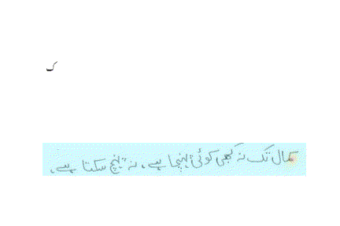

# CALText

This repository contains source code and pre-trained models of the CALText method introduced in "CALText: Contextual Attention Localization for Offline Handwritten Text" https://arxiv.org/abs/2111.03952

 

Dataset used to train and test the model for Urdu text can be found at http://faculty.pucit.edu.pk/nazarkhan/work/urdu_ohtr/pucit_ohul_dataset.html

Built on top of the [tensorflow version](https://github.com/wwjwhen/Watch-Attend-and-Parse-tensorflow-version) of the [WAP model](https://github.com/JianshuZhang/WAP).

# Requirements
- Python 3
- Tensorflow v1.6

# Directory structure
<pre>
datasets/
  -- PUCIT_OHUL
    -- train_lines/
    -- test_lines/
    -- train_lables.xlsx
    -- test_lables.xlsx
    -- generate_pickle_files.py <=== this file will read the PUCIT_OHUL dataset and populate the 'data/' folder with 7 pickle files (see below))
           Usage: python generate_pickle_files.py --valid_inds
    -- vocabulary.txt <=== will be generated by generate_pickle_files.py
  -- KHATT
    -- train_lines/
    -- test_lines/
    -- valid_lines/
    -- train_lables.xlsx
    -- test_lables.xlsx
    -- generate_pickle_files.py <=== this file will read the KHATT dataset and populate the 'data/' folder with 7 pickle files (see below))
           Usage: python generate_pickle_files.py --valid_inds
    -- vocabulary.txt <=== will be generated by generate_pickle_files.py
  -- YOUR OWN DATASET
    -- train_lines/
    -- test_lines/
    -- train_lables.xlsx or .csv or .txt
    -- test_lables.xlsx or .csv or .txt
    -- generate_pickle_files.py <=== this file will read YOUR CUSTOM DATASET and populate the 'data/' folder with 7 pickle files (see below))
    -- vocabulary.txt <=== will be generated by generate_pickle_files.py
data/
  -- train_lines.pkl
  -- valid_lines.pkl
  -- test_lines.pkl
  -- train_labels.pkl
  -- valid_labels.pkl
  -- test_labels.pkl
  -- vocabulary.pkl
results/
  -- valid_predicted.txt
  -- valid_target.txt
  -- valid_wer.wer
  -- test_predicted.txt
  -- test_target.txt
  -- test_wer.wer
  -- log.txt
chekpoints/
  -- cp-NUM-ACCURACY.ckpt  <== checkpoint files
models/
  -- current_best_model.ckpt  <== checkpoint file for currently best performing model on validation set
</pre>

# How to train on your own dataset
** Steps 1-5 can be replaced by your own custom methods. The goal is to populate the 'data/' folder with 6 pickle files corresponding to images and ground-truths of training, validation and test sets. **
1. Place all training line images in the folder "train_lines"
2. Place all testing line images in the folder "test_lines"
3. Place all training ground-truth labels in the file "train_labels.xlsx" using 2 columns. Column 1 contains image name/number. Column 2 contains the ground-truth label of the text contained in the image.
4. Place all testing ground-truth labels in the file "test_labels.xlsx" using 2 columns. Column 1 contains image name/number. Column 2 contains the ground-truth label of the text contained in the image.
5. Run "makepickle.ipynb" after specifying validation indices (if required). This will place all training, testing and validation images and labels in pickle format in the 'data/' folder.
6. For training, set mode="train", and run "CALText.py". This will place the trained model(s) in 'models/' folder.
7. For testing, set mode="test", set path of the model to be used and run "CALText.py".
8. For Contextual Attention, set alpha_reg=0, while training and testing.
9. For Contextual Attention Localization, set alpha_reg=1, while training and testing.

python CALText.py --mode=train{test} --dataset=PUCIT-OHUL{KHATT} --alpha_reg=1{0}

# Running on Local Machine
To run the code locally, copy the code from the .ipynb notebooks into "makepickle.py" and "CALText.py". Use following commands to run the code files:
- python makepickle.py
- python CALText.py

# Running on Google Colab
- To convert dataset to pickle files, run "makepickle.ipynb" in Google Colab.
- For training and testing, run "CALText.ipynb" notebook in Google Colab. For newer versions, make sure to run "%tensorflow_version 1.x" command in the first cell of "CALText.ipynb".
- Change runtime to GPU or TPU for better performance.
- Add the following lines to the notebook for accessing data from Google Drive:
 1. `from google.colab import drive`
 2. `drive.mount("/gdrive", force_remount=True)`

# References
PUCIT Offline Handwritten Urdu Lines (PUCIT-OHUL) Dataset: http://faculty.pucit.edu.pk/nazarkhan/work/urdu_ohtr/pucit_ohul_dataset.html
<pre>
@article{anjum_caltext_2021,
  author    = {Tayaba Anjum and Nazar Khan},
  title     = {{CALText}: Contextual Attention Localization for Offline Handwritten Text},
  journal   = {CoRR},
  volume    = {abs/2111.03952},
  year      = {2021},
  url       = {https://arxiv.org/abs/2111.03952},
  eprinttype = {arXiv},
  eprint    = {2111.03952},
}
</pre>

<pre>
@INPROCEEDINGS{anjum_icfhr2020_urdu_ohtr,
  author={Anjum, Tayaba and Khan, Nazar},
  booktitle={2020 17th International Conference on Frontiers in Handwriting Recognition (ICFHR)},
  title={An attention based method for offline handwritten Urdu text recognition},
  year={2020},
  pages={169-174},
  doi={10.1109/ICFHR2020.2020.00040}
}
</pre>

Previous Work:
- http://faculty.pucit.edu.pk/nazarkhan/work/urdu_ohtr/index.html
- http://faculty.pucit.edu.pk/nazarkhan/work/urdu_ohtr/ICFHR2020_manuscript.pdf
